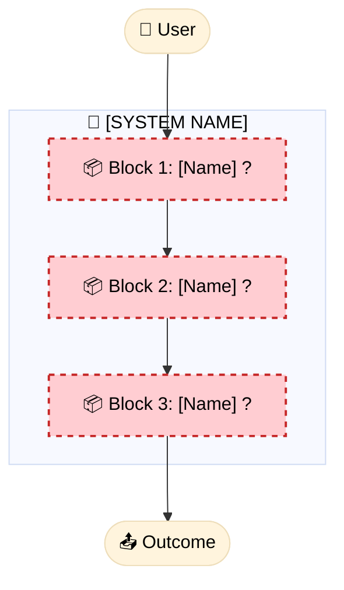
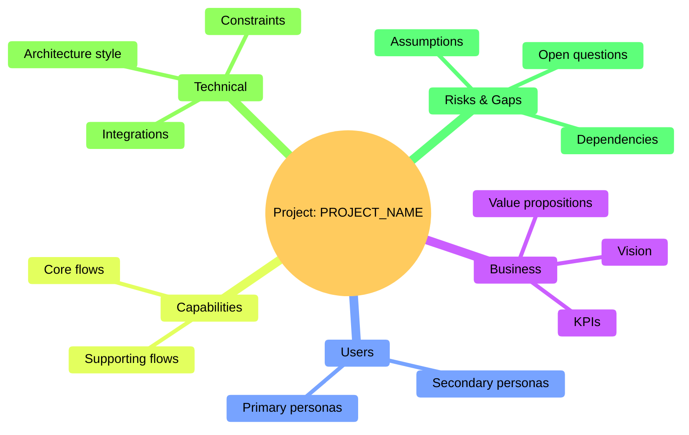

# Project Overview

> High-level, visual overview of the project, its status, and identified gaps

**Version**: V1 | **Created**: [DATE] | **Updated**: [DATE]

## 🎯 Project Macro View

> Short, high-level description of what the project does and for whom.

[DESCRIBE THE PROJECT IN 2–3 SENTENCES]

### Main Blocks Diagram

> **Guidelines**: 
> - Replace `[Name]` with your main functional blocks
> - Keep `?` and the `:::gap` class while the blocks are still unclear or incomplete
> - Add connections between blocks to reflect the real flow

### Global Project Mindmap (Mermaid)

### Business View

| Block | Business Objective | Primary User |
|-------|---------------------|--------------|
| [Block 1] | [What it solves for the business] | [Who uses it] |
| [Block 2] | [What it solves for the business] | [Who uses it] |
| [Block 3] | [What it solves for the business] | [Who uses it] |

### Technical View (when applicable)

| Block | Technical Components | Integrations |
|-------|-----------------------|-------------|
| [Block 1] | [Agents, APIs, services, etc.] | [MCPs, external systems] |
| [Block 2] | [Agents, APIs, services, etc.] | [MCPs, external systems] |
| [Block 3] | [Agents, APIs, services, etc.] | [MCPs, external systems] |

---

## 📊 Completion Status

### Project Artifacts

| Artifact | Status | Progress | Last Updated |
|----------|--------|----------|--------------|
| Constitution | ⚪ Not started | 0% | - |
| Project Context | ⚪ Not started | 0% | - |
| Specs | ⚪ Not started | 0/? | - |
| Plans | ⚪ Not started | 0/? | - |
| Tasks | ⚪ Not started | 0/? | - |
| Code | ⚪ Not started | 0% | - |

**Legend**:
- ⚪ Not started
- 🔴 Blocked / Needs attention
- 🟡 In progress / Draft
- 🟢 Complete / Validated

### Functional Blocks

| Block | Spec | Plan | Tasks | Code | Status |
|-------|------|------|-------|------|--------|
| [Block 1] | ⚪ | ⚪ | ⚪ | ⚪ | Not started |
| [Block 2] | ⚪ | ⚪ | ⚪ | ⚪ | Not started |
| [Block 3] | ⚪ | ⚪ | ⚪ | ⚪ | Not started |

---

## ⚠️ Identified Gaps

> Areas that require clarification or a decision before moving forward.

### Critical Gaps (Block progress)

- [ ] **[GAP-001]**: [Gap description]
  - Impact: [Which block/feature is affected]
  - Question: [What needs to be answered]

### Attention Gaps (Can proceed with assumptions)

- [ ] **[GAP-002]**: [Gap description]
  - Current assumption: [What we are assuming]
  - Risk: [What can go wrong]

### Resolved Gaps ✅

- [x] **[GAP-000]**: [Description] → Resolution: [How it was resolved]

---

## 🔄 Next Steps

> What should happen next to move the project forward.

1. [ ] [Most important next step]
2. [ ] [Second step]
3. [ ] [Third step]

---

## 📝 Version History

| Version | Date | Changes | Author |
|---------|------|---------|--------|
| V1 | [DATE] | Initial overview creation | [WHO] |

---

## 🔗 Quick Links

- **Constitution**: `.specify/memory/constitution.md`
- **Specs**: `specs/`
- **Project Context**: `project-context/`
- **Triage Backlog**: `.specify/triage/`

---

> **Note**: This file is updated automatically by Spec Kit commands.
> Treat it as the single source of truth for the current project status.
